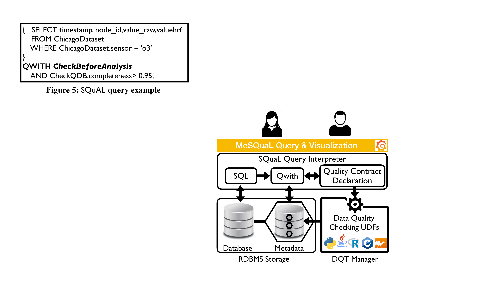

# MeSQuaL: Profiling and checking data quality declaratively with extended SQL

MeSQuaL is a system for profiling and checking data quality before further tasks, such as data analytics and machine learning. MeSQuaL extends SQL for querying relational data with constraints on data quality and facilitates the verification of statistical tests. 

<a href="url"></a>


The system includes: (1) a query interpreter for SQuaL, the SQL-extended language we propose for declaring and querying data with data quality checks and statistical tests; (2) an extensible library of user-defined functions for profiling the data and computing various data quality indicators; and (3) a user interface for declaring data quality constraints, profiling data, monitoring data quality with SQuaL queries, and visualizing the results via data quality dashboards. We showcase our system in action with various scenarios on real-world data sets and show its usability for monitoring data quality over time and checking the quality of data on-demand.


**For more details**

Please cite and refer to the demo presented at EDBT 2020 Conference:

- Ugo Comignani, Noël Novelli, Laure Berti-Équille:
Data Quality Checking for Machine Learning with MeSQuaL. EDBT 2020: 591-594 [Preprint](docs/publications/paper-241.pdf)

**Demo Videos**
* [Contract type and contract instance declaration](demo/videos/declaration_MeSQuaL.mp4)
* [Querying data with data quality constraints and statistical tests](demo/videos/query_MeSQuaL.mp4)
* [Monitoring data quality](demo/videos/monitoring_MeSQuaL.mp4)

## Installation

### Prerequisites

* [Grafana](https://grafana.com/) - Analytics and monitoring platform
* [Maven](https://maven.apache.org/) - Dependency Management
* Java SDK 11


### Installing MeSQuaL

#### Installing the engine
In the MeSQuaL-engine directory, to generate the parser, run:
```
mvn javacc:javacc
```

then, to produce a jar file, run:
```
mvn install
```
To avoid executing the unitary tests, instead of previous command run:
```
mvn install -DskipTests
```

#### Installing the visualization platform

At first, copy the querying interface plugin in the dedicated directory(/var/lib/grafana/plugins/ by default) and compile it.
For example, on linux systems run:
```
cp -R ./MeSQuaL-visualization/MeSQuaL-query-grafana-panel/ /var/lib/grafana/plugins/
cd /var/lib/grafana/plugins/MeSQuaL-query-grafana-panel/
npm install
yarn build
```

Then, in Grafana use the "Import" function and paste the content of the json file [grafana-dashboard-setting.json](MeSQuaL-visualization/grafana-dashboard-setting.json) to import the MeSQuaL dashboard.

If Grafana cannot load the querying plugin, then run:
```
npx npm-force-resolutions
npm install
```

## Deployment
Launch MeSQuaL engine by running:
```
java -jar common-1.0-SNAPSHOT-jar-with-dependencies.jar
```

then MeSQuaL interface can be accessed using Grafana. For Example, for a local installation of Grafana, connect to:
 ```
 http://localhost:3000
 ```

## Example datasets

We provides few datasets in the 'demo' directory.
These datasets corresponds to the one used in the demo paper presented at the EDBT2020 conference.

For MySQL, the csv files in ./data/datasets/ should be copied in the default directory /var/lib/mysql-files/.
Then the [createTablesAndLoadData.sql](demo/data/createTablesAndLoadData.sql) script 
can be used to generates the tables and imports the data.

## Built With
 * [Maven](https://maven.apache.org/) - Dependency Management used for MeSQuaL engine
 * [Yarn](https://yarnpkg.com/) - Dependency Management used for MeSQuaL plugins (if you want to modify the querying 
 plugin, please see the dedicated [README.md](MeSQuaL-visualization/MeSQuaL-query-grafana-panel/README.md) in 
 the plugin directory)

## Authors

* **Ugo Comignani**
* **Noël Novelli**
* **Laure Berti-Equille**

## License

This project is licensed under the GNU General Public License Version 3 - see the [LICENSE.md](LICENSE.md) file for details


